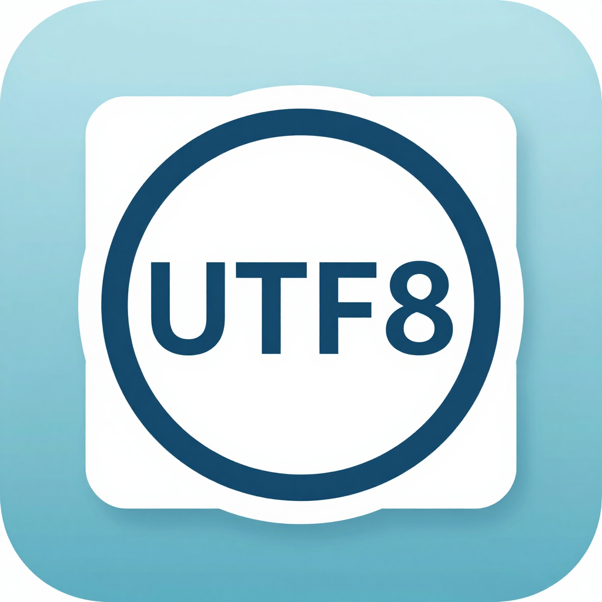

<div align="center">
  
  <h2>Any2UTF8</h2>
  <h3>Text/File to UTF-8 Converter (FasterEdge System Bootstrap Tool)</h3>
</div>

### 1. Introduction

- Any2UTF8 is a built-in local text/file encoding converter. Key differences from the system `iconv`:
  - **Built-in encodings, no dependency on system charset sets**: GBK / GB18030 / Big5 / Shift_JIS / EUC-JP / EUC-KR / UTF-16(LE/BE) / Windows-1252 / ISO-8859-* / KOI8-R and other common encodings are provided by a pure Go implementation (`golang.org/x/text`). When the system has no `iconv`, no matching `locale`, and no charset sets installed, the tool still converts — **"no local UTF-8 charset" is no longer a barrier**.
  - **Automatic source encoding detection**: when `-from` is not given, detection follows `BOM → valid UTF-8 → system default encoding (LANG/LC_ALL/LC_CTYPE) → GBK heuristic`; a warning is printed when detection relies on the system default encoding.
  - **Unknown encoding names** print the built-in list via `--list`; if system-level charset sets are really needed, it hints to install `locales` and run `locale-gen` (only for scenarios where other system tools need them).

### 2. Usage

```
any2utf8 [options] [files...]  # convert files, defaults to stdin
any2utf8 --list                # list built-in encodings
any2utf8 --sys-encoding        # print system default encoding detection result
any2utf8 --detect [files...]   # only detect source encoding, no conversion
```

| Option | Meaning |
| --- | --- |
| `-from encoding` | Source encoding (default auto: BOM → UTF-8 validation → system default → GBK heuristic) |
| `-to encoding` | Target encoding (default `utf-8`; e.g. `-to gbk` converts in reverse) |
| `-output file` | Output file (default stdout; mutually exclusive with `-inplace`) |
| `-inplace` | In-place conversion, atomically replaces the original file (keeps original permissions) |
| `-strict` | Strict mode: replacement characters/illegal sequences fail (exit 1) |
| `-list` / `-detect` / `-sys-encoding` | Informational subcommands |

> Constraint: stdin has a 1GiB limit (exceeding it errors out explicitly, no silent truncation); `-output` is single-file only (redirect or use `-inplace` for multiple files).

### 3. Examples

```sh
any2utf8 -from GBK report.txt > report.utf8.txt   # GBK → UTF-8
any2utf8 -inplace -from GB18030 old.txt           # in-place to UTF-8
cat log.txt | any2utf8 --detect                   # detect stdin encoding
any2utf8 -from auto *.txt                         # batch auto-detect conversion (to stdout)
any2utf8 -from GBK -to gbk -output back.txt a.txt # generic two-way conversion
```

### 4. System Default Encoding Detection

The tool reads `LC_ALL → LC_CTYPE → LANG` in order, takes the charset segment after the `.` in the locale name (e.g. `zh_CN.GBK` → GBK, `en_US.UTF-8` → UTF-8), and maps common aliases such as `GB2312 → GBK`, `CP936 → GBK`, `CP950 → Big5`, `CP932 → Shift_JIS`. `any2utf8 --sys-encoding` shows it directly.

### 5. Handling Missing Charset Sets

1. **Conversion layer (this tool)**: fully built-in, no system dependency — missing system charset sets do not affect conversion.
2. **Source encoding detection failure**: falls back to `UTF-8` with a warning; use `-strict` to fail on "replacement characters/illegal sequences" and prevent silent mojibake.
3. **When other system tools need charset sets**: hints to install `locales` and run `locale-gen` (Debian/Ubuntu: `apt install locales && locale-gen zh_CN.GBK` etc.).

### 6. Build & Test

Enabled via `OVERLAY_BUNDLES` (add the bundle directory to the list, e.g. `OVERLAY_BUNDLES="dhcp,fasteredgeos,any2utf8"`). Requires host Go 1.25+ (provided by `actions/setup-go` in CI). Offline upgrades can point `ANY2UTF8_SOURCE_DIR` at a local new source directory (must contain `main.go` / `go.mod` / `go.sum`).

```sh
go build -trimpath -ldflags="-s -w" -o any2utf8 .
go test ./...      # unit tests (encoding detection / two-way conversion / in-place replace / strict mode)
```

### 7. License

Apache-2.0 (consistent with the DontCrack family), see the repository LICENSE.

Current version: **1.0.20260913**